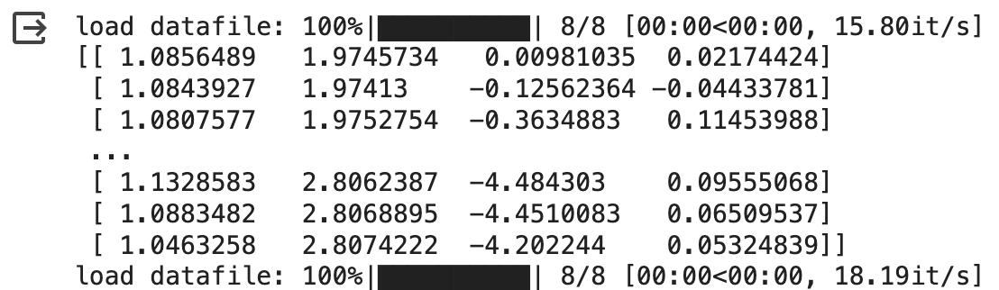
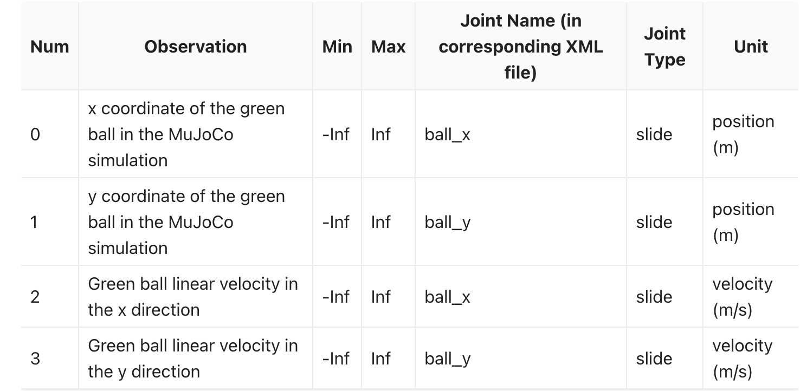
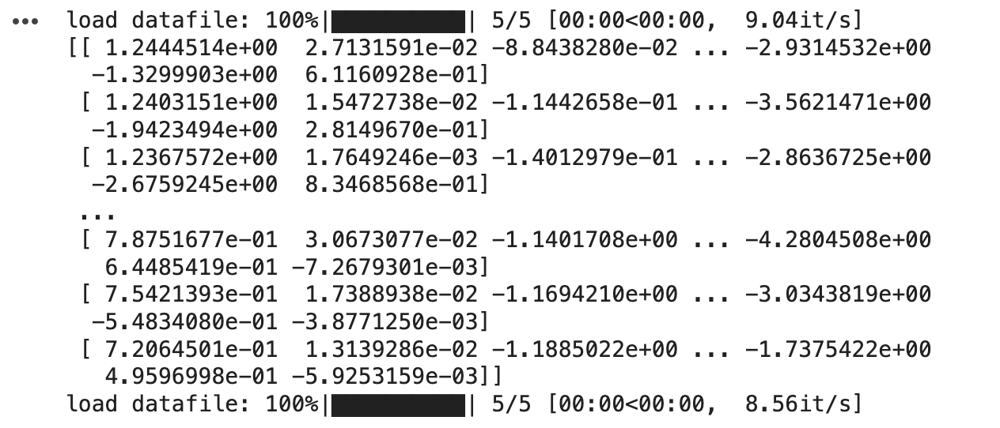
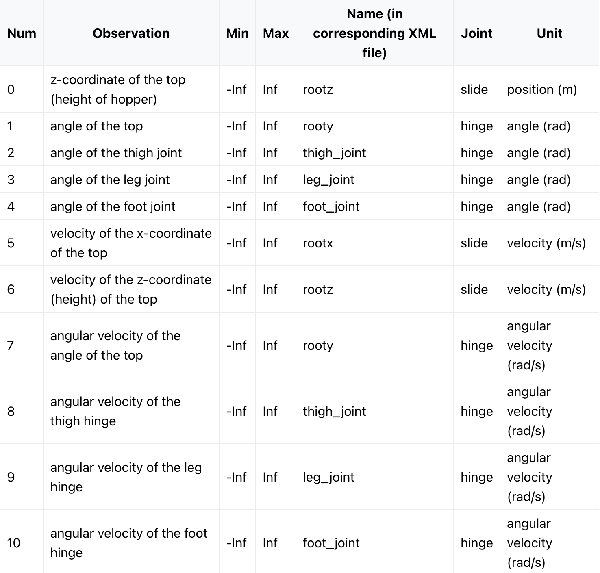

## HW1

### Problem 1.
---
1. For the first optimal equation, we can prove it as follow:
    
    By Total Probability Theorem, we know that
    
    $$
    V^\pi(s)= \sum_{a \in A} \pi(a|s)Q^\pi(s, a)
    $$
    
    Let state $s \in \mathcal{S}$, we define
    
    $$
    a^* = \argmax_{a\in \mathcal{A}} Q^{*}(s,a)
    $$
    
    Then for any policy $\pi$, we have:
    
    $$
    \begin{aligned}
    V^\pi(s) 
    &= \sum_{a \in A} \pi(a|s)Q^\pi(s, a) 
    \leq \sum_{a \in A} \pi(a|s)Q^*(s, a) 
    \leq \sum_{a \in A} \pi(a|s) Q^*(s, a^*) \\
    &= Q^*(s, a^*)\sum_{a \in A} \pi(a|s) 
    = Q^*(s, a^*) \cdot 1 
    = Q^*(s, a^*) \\
    &= \max_{a} Q^*(s, a)
    \end{aligned}
    $$
    
    The above equation is hold for any policy, so it must be true that 
    
    $$
    V^*(s) = \max_\pi V^\pi(s) = V^{\pi^*}(s)
    \leq \max_{a} Q^*(s, a)
    $$
    
    Now consider $V^*(s) < \max_a Q^*(s,a)$, by the assumption we can get there exist a policy $\phi$ such that $V^\phi(s)= \max_a Q^*(s,a) > V^*(s)$, but it’s a contradiction with the definition of $V^*(s) = \max_\pi V^\pi(s)$. So $V^*(s) = \max_a Q^*(s,a)$ for all state $s \in \mathcal{S}$.
    
    For the second optimal equation, which can be proved as follow:
    
    $$
    \begin{aligned}
    Q^*(s,a) 
    &= \max_\pi Q^\pi(s,a) \\
    &= \max_\pi \Big(R_{s,a} + \gamma \sum_{s^\prime \in S} P_{ss^\prime}^a V^\pi(s^\prime) \Big)\\
    &= R_{s,a}+ \gamma \sum_{s^\prime \in S} P_{ss^\prime}^a \max_\pi V^\pi(s^\prime) \\
    &= R_{s,a} + \gamma \sum_{s^\prime \in S} P_{ss^\prime}^a V^*(s^\prime)
    \end{aligned}
    $$
    
2. ***Proof.***
    
    $$
    \begin{aligned}
    ||T^*(Q)-T^*(Q')||_\infin
    &=
    \max_{s,a} |[T^*(Q)](s,a) - [T^*(Q')](s,a)| \\
    &=
    \max_{s,a} | (R_{s,a} + \gamma \sum_{s'}P^a_{ss'}\max_{a'}Q(s',a')) - (R_{s,a} + \gamma \sum_{s'}P^a_{ss'}\max_{a'}Q'(s',a') | \\
    &=
    \max_{s,a} |\gamma \sum_{s'}P^a_{ss'} (\max_{a'}Q(s',a')-\max_{a'}Q'(s',a'))| \\
    &\leq  \max_{s,a} \max_a |\gamma\sum_{s'}P^a_{ss'}(Q(s',a')-Q'(s',a'))| \\
    &=
    \max_{s,a} \max_a |\gamma( Q(s',a')-Q'(s',a'))| \\
    &\leq \gamma||Q-Q'||_\infin
    \end{aligned}
    $$
    
    Therefore, $T^*$ is $\gamma$-contraction operator ($\gamma < 1$).
    

### Problem 2.

---

1. ***Proof.***   For any two value function $V$ and $V'$
    
    $$
    \begin{aligned}
    ||T^\pi_\Omega(V) - T^\pi_\Omega(V^\prime)||_\infty &= ||(R^\pi+ \Omega + \gamma P^\pi V) - (R^\pi+ \Omega + \gamma P^\pi V^\prime)||_\infty \\
    &= \gamma ||P^\pi(V-V^\prime)||_\infty \\
    &\leq \gamma ||V-V^\prime||_\infty
    \end{aligned}
    $$
    
    Therefore, $T^\pi_\Omega$  is $\gamma$-contraction operator ($\gamma < 1$).
    
2. First we define Bellman optimality operator for regularized MDPs:
    
    $$
    [T^*_\Omega V](s) \coloneqq
    \max_\pi [T^\pi_\Omega V](s)
    =\max_\pi \Big( R_s^\pi + \Omega(\pi(\cdot|s)) + \gamma P_{ss'}^\pi V \Big)
    $$
    
    The pseudo code to solve $V^*_\Omega(s)$ is shown below:
    
    1. Initialize $k = 0$ and set $V_0(s)=0$ for all states.
    2. Repeat the following until convergence: $V_{k+1} \leftarrow T^*_\Omega(V_{k})$.
    
    Equivalently: for each state $s$:
    
    $$
    \begin{aligned}
    V_{k+1}(s) &= \max_\pi \Bigr[R^\pi_{s} + 
    \Omega(\pi(\cdot|s))+\gamma \sum_{s^\prime \in S} P_{ss^\prime}^\pi V_k(s^\prime) \Bigr] \\
    &=
    \max_\pi \Bigr[R^\pi_{s} - 
    \sum_{a\in\mathcal{A}}\pi(a|s)\ln\pi(a|s)+\gamma \sum_{s^\prime \in S} P_{ss^\prime}^\pi V_k(s^\prime) \Bigr]
    \end{aligned}
    $$
    
    Because $T^*_\Omega$ is a contraction operator and $V^*_\Omega$ is a fixed point of  $T^*_\Omega$, so when $k$ is big enough, $V_k \rightarrow V^*_\Omega$ due to uniqueness. Then we can derive $Q^*_\Omega$ from the equation:
    
    $$
    \text{For each action $a$ and state $s$}:\quad Q^*_\Omega(s,a)=R_s^a+\gamma E_{s'\sim P(\cdot|s,a)}[V^*_\Omega(s')]
    $$
    

### Problem 3.

---

$$
\begin{aligned}
\frac{1}{1 - \gamma } \mathbb{E}_{s \sim d_\mu^{\pi_0}}\ 
\mathbb{E}_{a \sim \pi_\theta(\cdot|s)} [f(s,a)] 
&=
\frac{1}{1 - \gamma } \sum_{s \in \mathcal{S}} d_\mu^{\pi_0}(s)
\Big(\mathbb{E}_{a \sim \pi_\theta(\cdot|s)} [f(s,a)] \Big) \\
&=
\frac{1}{1 - \gamma } \sum_{s \in \mathcal{S}} d_\mu^{\pi_0}(s)
\sum_{a \in \mathcal{A}} \pi_\theta(a|s) \cdot f(s,a)  \\
&=
\mathbb{E}_{s_0 \sim \mu} \Big[ \sum_{s \in \mathcal{S}} \sum_{t = 0}^{\infin} \gamma^t P(s_t = s|s_0, \pi_0) \sum_{a \in \mathcal{A}} \pi_0(a|s) \cdot f(s,a)
\Big] \\
&=
\sum_{\tau}\sum_{t = 0} ^{\infin}
\gamma^tP_\mu^{\pi_0}(\tau) \cdot f(s,a) \\
&=
\mathbb{E}_{\tau \sim P_\mu^{\pi_0}}\Big[\sum_{t = 0} ^{\infin}\gamma^t f(s,a)\Big]
\end{aligned}
$$

### Problem 4.
```python
def value_iteration(env, gamma=0.9, max_iterations=10**6, eps=10**-3):
    num_spaces = env.observation_space.n
    num_actions = env.action_space.n
    
    # Initialize with a random policy
    policy = np.array([env.action_space.sample() for _ in range(num_spaces)])
    
    ##### FINISH TODOS HERE #####
    #print('VI: ')
    R,P = get_rewards_and_transitions_from_env(env)
    V = np.zeros(num_spaces)
    for _ in range(max_iterations):
        #print(_)
        criterion = 0
        V_ = V.copy() # V_ stands for the last V_k, and V stands for V_k+1
        for s in range(num_spaces):
            max_v, best_a = -float('inf'), -1 # max_v: the maximum of Q_k(s,a), best_a: the best action to do given state s
            for a in range(num_actions):
                value = 0
                for s_ in range(num_spaces):
                    value += P[s, a, s_] * (R[s, a, s_] + gamma * V_[s_])
                if (value > max_v):
                    max_v, best_a = value, a
            V[s], policy[s] = max_v, best_a
            criterion = abs(np.sum(V) - np.sum(V_))
        if criterion < eps:
            break
    
    #############################
    
    # Return optimal policy    
    return policy

def policy_iteration(env, gamma=0.9, max_iterations=10**6, eps=10**-3):
    num_spaces = env.observation_space.n
    num_actions = env.action_space.n
    
    # Initialize with a random policy
    policy = np.array([env.action_space.sample() for _ in range(num_spaces)])
    
    ##### FINISH TODOS HERE #####
    # print('PI: ')
    R,P = get_rewards_and_transitions_from_env(env)
    policy_prev = np.zeros(num_spaces)
    V = np.zeros(num_spaces)
    # cnt = 0
    while not np.array_equal(policy, policy_prev):
        policy_prev = policy.copy()
        
        # IPE
        for _ in range(max_iterations):
            # print(_)
            criterion = 0
            V_ = V.copy() # V_ stands for the last V_k, and V stands for V_k+1
            for s in range(num_spaces):
                value = 0
                for s_ in range(num_spaces):
                    value += P[s, policy[s], s_] * (R[s, policy[s], s_] + gamma * V_[s_])
                V[s] = value
            criterion = abs(np.sum(V) - np.sum(V_))
            if criterion < eps:
                break

        # One-Step Policy Improvement
        for s in range(num_spaces):
            max_q, best_a = -float('inf'), -1
            for a in range(num_actions):
                value = 0
                for s_ in range(num_spaces):
                    value += P[s, a, s_] * (R[s, a, s_] + gamma * V[s_])
                if value > max_q:
                    max_q, best_a = value, a
            policy[s] = best_a
        # cnt += 1
        # print(cnt)
    #############################

    # Return optimal policy
    return policy
```

### Problem 5.

---

After setting up all the dependencies that D4RL package needs, I successfully ran `d4rl_sanity_check.py` and gain the following results:



From the documentation of Gym ([link](https://robotics.farama.org/envs/maze/point_maze/)), we know that observation dataset is an `ndarray` of shape `(4,N)`. The elements of the array correspond to the following:




Then I modified the `env = gym.make('maze2d-umaze-v1')` to `env = gym.make('hopper-medium-v0')`, a task of MuJoCo. 



From the documentation of Gym ([link](https://www.gymlibrary.dev/environments/mujoco/hopper/)), we know that observation dataset is an `ndarray` of shape `(11,N)`. The elements of the array correspond to the following:


