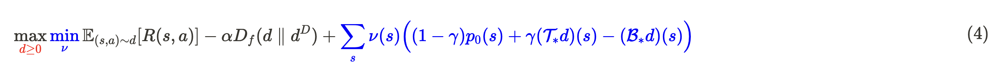
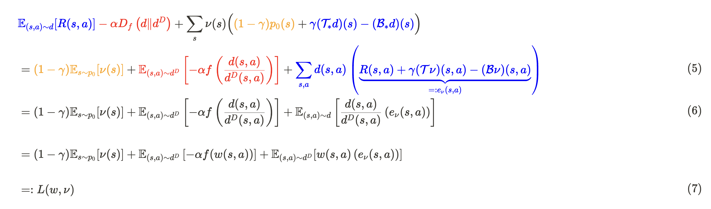
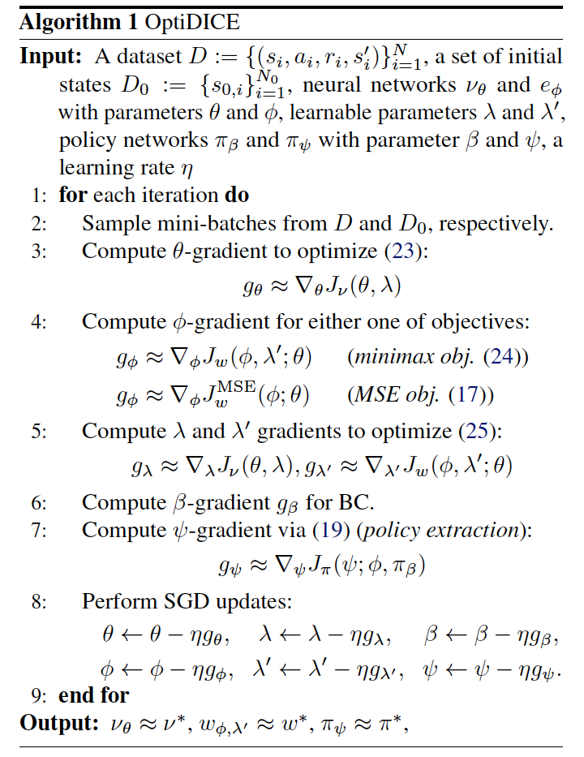
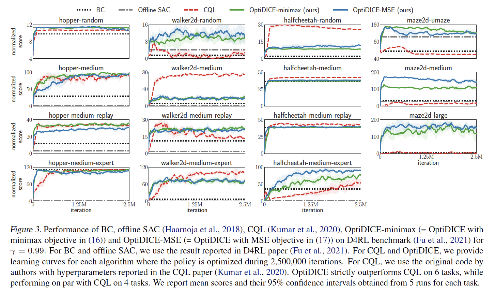

# Note on OptiDICE: Offline Policy Optimization via Stationary Distribution Correction Estimation

To provide a better reading experience, it is recommended to use a Notion link for reading.  [Notion Page Link](https://wholesale-archeology-a9b.notion.site/Theory-Project-f444a80b64b14b0db98201cd6421ba3b?pvs=4)

In the world of RL, teaching an agent to make smart decisions without real-world interactions is a significant challenge. This blog post explores OptiDICE, a groundbreaking approach in offline RL. Unlike traditional methods, OptiDICE prevents errors by directly correcting decision-making patterns, offering a simpler and more effective solution. Join us as we dive into how this innovative algorithm outperforms existing techniques and what it means for the future of RL.

## Introduction
Due to the rapid development of fields such as CV and NLP in recent years, the ability to collect large-scale datasets has become a crucial factor. The standard ML workflow involves training models based on these datasets and updating parameters until the models meet our expected results. This is feasible because ML tasks usually have environments with standard answers, such as handwriting recognition, object detection, and sentiment analysis, etc. These tasks do not involve randomness and therefore do not require any sense of exploration.

However, in the world of RL, this approach encounters significant difficulties. The core concept of RL is to learn through trial-and-error experiences. Once we use an offline dataset, the exploration component is completely lost. On the other hand, the cost of online RL interacting with the environment is too high. Imagine training an "autonomous driving agent" where each policy update requires the agent to collect driving experience in a city. Updating the policy based on this experience would need many iterations to converge, which is a major bottleneck for RL in practical applications.

As a result, in recent years, there has been continuous research on offline RL algorithms, attempting to address the various limitations caused by offline datasets. However, most of these methods cannot escape a common problem: the Q function overestimation caused by distribution shift. First, it is essential to understand what distribution shift is. In offline RL, it refers to the difference in state-action distribution between the policy used to collect the data and the policy being trained. This issue is challenging to resolve without collecting online data. Consequently, most RL algorithms use various complex techniques to underestimate action values, but this introduces additional hyperparameters that require proper fine-tuning.

In this context, the paper introduces an alternative approach to avoid the overestimation problem by reducing the discrepancy between the optimal policy’s stationary distribution and the data distribution, thereby mitigating the distribution shift effect. This stationary distribution correction can be estimated using a minimax function, which only requires sampling from the dataset and not from the target policy. This method was proposed in a previous paper, **AlgaeDICE** [1], and is not the main contribution of this paper. The primary contribution of this paper is transforming the minimax problem into an unconstrained convex optimization problem, making the optimization process much more stable.

## Preliminaries
### Notaion
Before we begin analyzing the OptiDICE algorithm, let's first define some symbols and terms that will frequently appear throughout this paper:

- **Static offline dataset $D$**
    $$
    D=\{(s_i,a_i,r_i,s'_i)\}_{i=1}^N
    $$    
    - the dataset used to train the Agent, where $N$ represents the total number of data sets.
    - Each data set is composed of tuples consisting of state, action, reward, and next state.
    
- **Stationary distribution $d^\pi$**
    $$
    d^\pi(s, a) = \begin{cases} \displaystyle (1 - \gamma) \sum_{t=0}^{\infty} \gamma^t \Pr(s_t = s, a_t = a) & \text{if } \gamma < 1, \\ \displaystyle \lim_{T \to \infty} \frac{1}{T + 1} \sum_{t=0}^{T} \Pr(s_t = s, a_t = a) & \text{if } \gamma = 1\end{cases}
    $$
    - aka “occupancy measure for policy $π$”
    - Similar to the state visitation distribution taught in class, except that the sample space here is the state-action pair, which is represented as $d^\pi:\mathcal{S} \times \mathcal{A} \to \mathbb{R}$.
    
- **Empirical Distribution of the Dataset $d^D$**

    This formula does not appear in the paper; it is my interpretation after reading it. The actual calculation might differ from this.
    
    $$
    d^D(s,a)=\frac{1}{N}\sum_{i=1}^N I(s_i = s,a_i=a) \\
    d^D(s,a, s')=\frac{1}{N}\sum_{i=1}^N I(s_i = s,a_i=a, s'_i=s')
    $$
    
- **F-divergence between $d^\pi$ and $d^D$**
    
    $$
    D_f(d^\pi \parallel d^D) := \mathbb{E}_{(s,a) \sim d^D} \left[ f \left( \frac{d^\pi(s, a)}{d^D(s, a)} \right) \right]
    $$
    
- **Stationary distribution correction $w(s,a)$**

    $$
    w(s,a)=\frac{d(s, a)}{d^D(s, a)}
    $$
    
    a ratio between $d$ and $d^D$, we will use function approximation to evaluate its value and use it to optimize our policy
    
- **Optimal Policy $\pi^*$**
    - $\alpha > 0$: penalizing distribution shift, a hyperparameter which balances between pursuing the reward-maximization and penalizing the deviation from the distribution of the offline dataset.
    
    $$
    \pi^* := \arg\max_{\pi} \mathbb{E}_{(s,a) \sim d^\pi}[R(s, a)] - \alpha D_f(d^\pi \parallel d^D)
    $$
    
- **Optimal Stationary Distribution $d^*$**
    - Because optimizing for $\pi$ involes the evaluation of $d^\pi$ which is not directly accessible in the offline RL setting, here we change to optimize a stationary distribution $d: \mathcal{S}\times \mathcal{A} \to \mathbb{R}$
    
    $$
    d^* := \arg\max_d \mathbb{E}_{(s,a) \sim d}[R(s, a)] - \alpha D_f(d \parallel d^D)
    $$
    
    - We can easily obtain $\pi^*$ from $d^*$ using the following formula:
        
    $$
    \pi^*(s|a) = \frac{d^*(s,a)}{\sum_{\bar a}d^*(s,\bar a)}
    $$
        
- **Marginalization Operator $(\mathcal{B}_*d)(s)$ and $(\mathcal{B}\nu)(s,a)$**
    
    $$
    (\mathcal{B}_*d)(s)  = \sum_{\bar a} d(s, \bar a) \\
    (\mathcal{B}\nu)(s,a) =\nu(s)
    $$
    
- **Transposed Bellman Operator $(\mathcal{T}_*d)(s)$ and $(\mathcal{T}\nu)(s,a)$**
    
    $$
    (\mathcal{T}_*d)(s) = 
    \sum_{\bar s,\bar a} P_{s\bar s}^{\bar a}\cdot d(\bar s, \bar a) \\
    (\mathcal{T}\nu)(s,a) = \sum_{s'} P_{ss'}^a \cdot \nu(s')
    $$
    
- **State value function $V(s)$**
    
    In this paper, it is used as the Lagrange multiplier $\nu(s)$ and does not specifically mention the state value function. However, the underlying meaning is the same. For ease of understanding, we define it here.
    
    $$
    V(s):=\nu(s)=(\mathcal{B}\nu)(s,a)
    $$
    
- **State-action value function $Q(s,a)$**
    
    In this paper, $Q(s,a)$ is not used. However, to more intuitively understand how the Advantage function $e_\nu(s,a)$ is derived later, let's first write it out using the definitions provided in the paper.
    
    $$
    Q(s,a) = R(s,a)+\gamma \sum_{s'}P^a_{ss'}V(s') = R(s,a)+\gamma(\mathcal{T}\nu)(s,a)
    $$
    
- **Advantage function $e_\nu(s,a)$**
    
    Here, we use the notation $e_\nu(s,a)$ in accordance with the symbols used in the paper, rather than the more common $A(s,a)$. However, its underlying meaning is the same as in general Reinforcement Learning (RL).
    
    $$
    e_\nu(s,a)=Q(s,a) - V(s)=R(s,a)+\gamma(\mathcal{T}\nu)(s,a)-(\mathcal{B}\nu)(s,a)
    $$
    
### Problem Formulation
To obtain the optimal policy $\pi^*$, we must first determine the optimal stationary distribution $d^*$:

$$
\max_d \mathbb{E}_{(s,a) \sim d}[R(s, a)] - \alpha D_f(d \parallel d^D) \tag{1}
$$

At the same time, the following two conditions (Bellman flow constraints) must be satisfied:

$$
\begin{align*}
(\mathcal{B}_*d)(s)=(1-\gamma)p_0(s)+\gamma(\mathcal{T}_*d)(s)\ \forall s \tag{2} 
\\ d(s,a) \geq 0 \ \forall s,a 
\tag{3}
\end{align*}
$$

Based on these two constraints，we then obtain Lagrangian function for the constrained optimization

The part marked in red is added by Constraint 1, and the part marked in blue is from Constraint 2. Here, $\nu(s)$ is the Lagrangian multiplier and also the state value function. However, since obtaining the expected value of the target distribution for the above equation is quite complex, we can rewrite it and obtain the following equation:

(3): Different colors represent corresponding parts of the equation for easier understanding of the derivation process. Notably, we replace part of the equation with the previously defined advantage function $e_\nu(s,a)$.

(4): By multiplying the numerator and denominator of the blue part in (3) by $d^D(s,a)$, we can transform the optimization target into the stationary distribution correction $w(s,a)$.

:::info
#### Remark:
When actually calculating (5), we will only sample data from the dataset distribution $d^D$ to estimate $L(w,\nu)$, without using the target distribution. The symbol for estimating $L(w,\nu)$ is denoted as $\hat{L}(w,\nu)$, and the formula is as follows:

$$
\hat L(w,\nu) := (1 - \gamma) \mathbb{E}_{s \sim p_0} [\nu(s)] + \mathbb{E}_{(s,a,s') \sim d^D} \left[ - \alpha f (w(s, a))  +w(s, a) \cdot \hat e_{\nu}(s, a, s') \right]
$$

Here, $\hat{e}_\nu(s,a,s') := R(s,a) + \gamma \nu(s') - \nu(s)$ is an estimate of the original advantage function $e_\nu(s,a)$. This is to avoid the estimation errors commonly seen in other offline RL algorithms, as calculating the Q value might require out-of-distribution action samples.
:::

In simple terms, the goal of OptiDICE is to find the solution to the following maximin problem, thereby obtaining the optimal solution $w^*$ to calculate the optimal policy $\pi^*$:

$$
\max_{w\geq0}\min_\nu {L(w,\nu)}
\tag{8}
$$

## Supporting Lemmas and Theoretical Analysis
### A closed-form solution

To optimize the original problem computationally, the authors proposed some methods to reduce the nested-optimization problem to a single layer.

Firstly, since (1)-(3) form a convex optimization problem, it can be proven to have strong duality. This allows us to reverse the max and min in the original optimization problem (8), transforming it from a maximin to a minimax problem:

$$
\min_\nu \max_{w\geq0} {L(w,\nu)}
\tag{9}
$$

Next, for the inner maximization problem, with $\nu$ fixed, the authors found the closed-form solution for $w$ as follows, where $(f')^{-1}$ is the inverse function of the derivative of $f$ and is strictly increasing:

$$
w^*_\nu(s,a) = \max \left(
0,(f')^{-1}\left(\frac{e_\nu(s,a)}{\alpha}\right)
\right)\ \forall s,a
\tag{10}
$$

Because the proof of this process is very complex, it is omitted here for brevity. However, we can intuitively understand this formula: First, taking the max with 0 is added to ensure our constraint $w \geq 0$, which is straightforward. On the right side of the equation, we see that $w^*_\nu(s,a)$ increases as the advantage grows, aligning with our general understanding of RL. This formula is also influenced by the penalizing distribution shift parameter $\alpha$. As $\alpha$ increases, the penalty for distribution deviation also increases, meaning the weight for the advantage function decreases. The function $f$ defines how the stationary distribution correction affects our optimization target, with detailed definitions available in the previous section.

By using the closed-form solution, we decompose the original minimax problem into two subproblems that can be solved separately. Having solved the inner maximization, we substitute $w^*_\nu(s,a)$ back into the original equation (7) to solve for the minimization:

$$
\min_{\nu} L(w^*_\nu,\nu)=(1 - \gamma) \mathbb{E}_{s \sim p_0} [\nu(s)] + \mathbb{E}_{(s,a) \sim d^D} \left[ - \alpha f \left(\max \left(
0,(f')^{-1}(\frac{1}{\alpha}e_\nu(s,a))
\right)\right) \right] + \mathbb{E}_{(s,a) \sim d^D} 
\left[
 \max \left(
0,(f')^{-1}(\frac{1}{\alpha}e_\nu(s,a))
\right) \left( e_{\nu}(s, a) \right) 
\right] \tag{11}
$$

Interestingly, we can prove that $L(w^*\nu, \nu)$ is a convex function of $\nu$, making it relatively easy to find its minimum, significantly simplifying the original nested minimax optimization. When actually estimating it, we should use $\hat{e}\nu(s,a,s') := R(s,a) + \gamma \nu(s') - \nu(s)$ to calculate its value, denoted as $\hat{L}(\nu)$:

$$
\hat L(\nu)
=(1 - \gamma) \mathbb{E}_{s \sim p_0} [\nu(s)] + \mathbb{E}_{(s,a,s') \sim d^D} \left[ - \alpha f 
\left(
\max 
\left(
0,(f')^{-1}(
\frac{1}{\alpha}\hat e_\nu(s,a,s'))
\right)
\right) 
+
\max \left(
0,(f')^{-1}(\frac{1}{\alpha}\hat e_\nu(s,a,s')
\right) \left( \hat e_\nu(s,a,s') \right)
\right]  \tag{12}
$$

However, this estimate is not unbiased. Fortunately, through proof, we can know that $\hat{L}(\nu)$ is an upper bound of $L(w^*_\nu, \nu)$ (i.e., $L(w^*_\nu, \nu) \leq \hat{L}(\nu)$ always holds). Therefore, by optimizing $\hat{L}(\nu)$, we can still ensure that $L(w^*_\nu, \nu)$ is also reduced.

### Function approximation for $w(s,a)$ and $\nu(s)$
After clarifying the entire algorithm flow, we can begin to look at some implementation details, starting with how to estimate the two core functions in OptiDICE: the stationary distribution correction $w(s,a)$ and the Lagrange multiplier $\nu(s)$.

Here we introduce the first two deep neural networks of OptiDICE: $\theta$ and $\phi$, which are the parameters for optimizing $\nu$ and $w$, respectively. First, for $\theta$, according to (12), we optimize it using the following method:

$$
\min_\theta J_\nu(\theta) := \min_\theta \hat L(\nu_\theta) \tag{13}
$$

After obtaining the optimizing solution $\theta^*$, we next need to calculate $w^*(s,a) = \frac{d^{\pi^*}(s,a)}{d^D(s,a)}$ to derive the final optimal policy $\pi^*$. There are two methods to achieve this:

1. Maximizing $\hat L(w_\phi,\nu_\theta)$ , which corresponds to solving the original minimax problem.
    
    $$
    \min_\phi J_w(\phi;\theta) := \min_\phi -\hat L(w_\phi,\nu_\theta) \tag{14}
    $$
    
2. Minimizing MSE between $e_\phi(s,a)$ and $\hat e_{\nu_\theta}(s,a,s')$ 
    
    $$
    \min_\phi J_w^{\text{MSE}}(\phi;\theta) := \min_\phi  \mathbb{E}_{(s,a,s')\sim d^D}\left[( e_\phi(s,a) - \hat e_{\nu_\theta}(s,a,s'))^2\right] \tag{15}
    $$
    

### Policy extraction
The final step is to calculate our optimal policy. Generally, we can obtain it using the following formula:

$$
\pi^*(a|s) = \frac{d^D(s,a)w_\phi(s,a)}{\sum_{\bar a}d^D(s,\bar a)w_\phi(s,\bar a)}  \tag{16}
$$

However, for continuous domains, this method is not feasible. So, we optimize the parameterized policy $\pi_\psi$ by minimizing the discrepancy between $\pi_\psi(a|s)$ and $\pi^*(a|s)$ on the stationary distribution over states from $\pi_D$.

$$
\min_\psi \mathbb{KL}(d^D(s)\pi_\psi(a|s)||d^D(s)\pi^*(a|s)) \tag{17}
$$

Rearrange it:

$$
\begin{align*}
\mathbb{KL} \left( d^D(s) \pi_\psi(a|s) \| d^D(s) \pi^*(a|s) \right)&= -\mathbb{E}_{s \sim d^D, a \sim \pi_\psi(s)} \left[ \log \frac{d^*(s, a)}{d^D(s, a)} - \log \frac{\pi_\psi(a|s)}{\pi_D(a|s)} - \underbrace{\log \frac{d^*(s)}{d^D(s)}}_{\text{constant for }\pi} \right] 
\\
&= -\mathbb{E}_{s \sim d^D, a \sim \pi_\psi(s)} \left[ \log w_\phi(s, a) - \mathbb{KL} \left( \pi_\psi(\bar{a}|s) \| \pi_D(\bar{a}|s) \right) \right] + C 
\\ \\
&=: J_\pi (\psi; \phi, \pi_D) \tag{18}
\end{align*}
$$

Note that this requires us to evaluate $\pi_D$ for the KL regularization term. For this, we employ another parameterized policy $\pi_\beta$ to approximate $\pi_D$, trained via sample behavioral cloning (BC).

### Generalization to $\gamma=1$

For $\gamma = 1$, our original constraints (2) and (3) may become an ill-posed problem. To address this issue, we add another normalization constraint $\sum_{s,a}d(s,a)=1$ to (1-3). So we need to introduce a Lagrange multiplier $\lambda$ to our original minimax problem and change the variable $d$ to $w$:

$$
\begin{aligned}
\min_{\nu,\lambda} \max_{w\geq0} L(w,\nu,\lambda) &:= L(w,\nu) {+ \lambda (1 - \mathbb{E}_{(s,a)\sim d^D}[w(s,a)])} \\ &= (1 - \gamma) \mathbb{E}_{s \sim p_0} [\nu(s)] + \mathbb{E}_{(s,a) \sim d^D} \left[ - \alpha f (w(s, a)) \right] + \mathbb{E}_{(s,a) \sim d^D} [ w(s, a) \left( e_{\nu}(s, a) {- \lambda}  \right) ] + {\lambda}
\end{aligned} \tag{19}
$$

Similarly, define $\hat L(w,\nu,\gamma)$ for estimating  $L(w,\nu,\gamma)$, where $e_{\nu,\lambda}(s, a, s') := e_{\nu}(s, a, s') - \lambda$

$$
\hat L(w,\nu,\gamma) := (1 - \gamma) \mathbb{E}_{s \sim p_0} [\nu(s)] +{\lambda} + \mathbb{E}_{(s,a,s') \sim d^D} \left[ - \alpha f (w(s, a))  +w(s, a) \cdot \hat e_{{\nu,\lambda}}(s, a, s') \right] \tag{20}
$$

Similar to (10-12), we can applying the new close form solution with $\lambda$ to $L(w,\nu,\gamma)$ and obtain a biased estimate $\hat L(\nu, \lambda)$:

$$
w^*_{\nu, \lambda}(s,a) = \max \left(
0,(f')^{-1}\left(\frac{e_\nu(s,a) - \lambda}{\alpha}\right)
\right)\ \forall s,a
\tag{21}
$$

$$
\hat L(\nu)
=(1 - \gamma) \mathbb{E}_{s \sim p_0} [\nu(s)] + \mathbb{E}_{(s,a,s') \sim d^D} \left[ - \alpha f 
\left(
\max 
\left(
0,(f')^{-1}(
\frac{1}{\alpha}\hat e_{{\nu,\lambda}}(s,a,s'))
\right)
\right) 
+
\max \left(
0,(f')^{-1}(\frac{1}{\alpha}\hat e_{{\nu,\lambda}}(s,a,s')
\right) \left( \hat e_{{\nu,\lambda}}(s,a,s') \right)
\right]  +
{\lambda}
\tag{22}
$$

Then we can optimize $\theta, \phi$ for $\nu$ and $w$, similar to (13-14), and here we need two more parameter $\lambda$ and $\lambda'$ for normalization constraint.

$$
\min_\theta J_\nu(\theta, \lambda) := \min_\theta \hat L(\nu_\theta, \lambda) \tag{23}
$$

$$
\min_\phi J_w(\phi, \lambda';\theta) := \min_\phi -\hat L(w_{\phi, \lambda'},\nu_\theta, \lambda') \tag{24}
$$

$$
\min_\lambda J_\nu(\theta,\lambda) \quad \text{and} \quad \min_\phi J_{\lambda'}(\phi, \lambda'; \theta) \tag{25}
$$

## Discussions and Takeaways
I believe the primary contribution of this paper lies in its proposal of a very stable method for policy optimization. Currently, among the DICE algorithms, only AlgaeDICE addresses policy optimization, while others focus solely on policy evaluation or imitation learning. Although AlgaeDICE introduces a different approach to optimization, it ultimately requires solving a nested maximin problem, which leads to instability. In contrast, this paper uses a closed-form solution to decompose the original problem while maintaining the original optimization properties, thus ensuring stability.

## References
1. Ofir Nachum, Bo Dai, Ilya Kostrikov, Yinlam Chow, Lihong Li, Dale Schuurmans: AlgaeDICE: Policy Gradient from Arbitrary Experience
2. Standford University: Convex Optimization